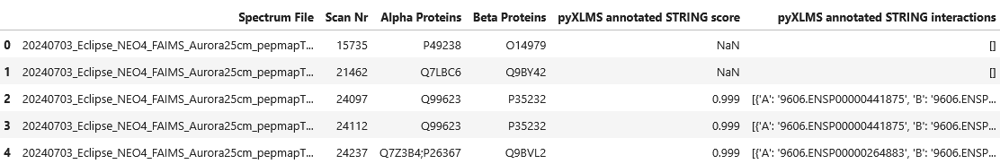
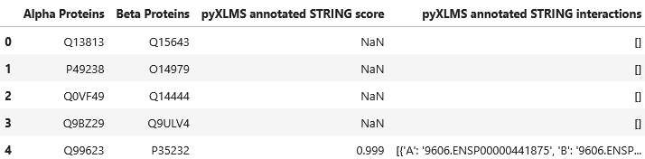

import { Callout } from 'nextra/components'

# Annotating STRING Score and Interactions


```python copy
from pyXLMS import __version__

print(f"Installed pyXLMS version: {__version__}")
```
<Callout emoji="✓">
```
    Installed pyXLMS version: 1.8.7
```
</Callout>


```python copy
from pyXLMS import parser
from pyXLMS import transform
```

All data transformation functionality - including `annotate_string_scores()` - is available via the `transform` submodule. We also import the `parser` submodule here for reading result files.


```python copy
parser_result = parser.read(
    [
        "../../data/ms_annika/Nucleus_Rep1_CSMs.parquet",
        "../../data/ms_annika/Nucleus_Rep1_Crosslinks.parquet",
    ],
    engine="Custom",
    crosslinker="DSBSO",
)
```
<Callout emoji="✓">
```
    Reading CSMs...: 100%|█████████████████████████████████████████████████████████████████████████████████████████| 3770/3770 [00:00<00:00, 5587.00it/s]
    Reading crosslinks...: 100%|██████████████████████████████████████████████████████████████████████████████████| 2937/2937 [00:00<00:00, 10661.80it/s]
```
</Callout>

We read crosslink-spectrum-matches (CSMs) and crosslinks using the [generic parser](https://hgb-bin-proteomics.github.io/pyXLMS/pyXLMS.parser.html#pyXLMS.parser.read) from two `.parquet` files. These files contain CSMs and crosslinks validated for 1% estimated CSM/crosslink-level FDR respectively with data from human K562 nuclei from [this study](https://doi.org/10.1038/s42004-025-01644-6).


```python copy
csms = parser_result["crosslink-spectrum-matches"]
xls = parser_result["crosslinks"]
```

For easier access we assign our crosslink-spectrum-matches to the variable `csms` and our crosslinks to the variable `xls`.

## STRING Annotation of Crosslink-Spectrum-Matches


```python copy
csms = transform.annotate_string_scores(csms, organism="Homo sapiens")
```
<Callout emoji="✓">
```
    Mapped 518 of 525 proteins (98.66666666666667%) to STRING IDs.
    Annotating STRING scores for inter-links...: 100%|█████████████████████████████████████████████████████████████| 478/478 [00:00<00:00, 238988.83it/s]
```
</Callout>

We can annotate the [STRING](https://string-db.org/) score and STRING interactions for our inter-link CSMs by passing the CSMs as the first argument. Because this function internally calls the STRING API we also need to specify an organism, e.g. in this case `"Homo sapiens"`. You can also specify the taxon identifier instead of the common name, which is actually the preferred way of passing the organism. You can find the taxon identifier of your organism [here](https://string-db.org/cgi/organisms). Before querying the STRING API for interactions all protein names are resolved to STRING IDs. The function will print information of how many proteins were possible to resolve to STRING IDs - if this number is low it's most likely because your proteins have custom names that are uncommon in public databases. Preferably protein names are [UniProtKB](https://www.uniprot.org/) accession codes or gene names.

Because this function is calling the STRING API it requires internet access and is also limited to a maximum of 2000 proteins! Please also use this function responsibly as the STRING API is provided for free to everyone!

> [!IMPORTANT]
>
> **Please note that STRING annotation is only possible for inter-links and if all data have associated proteins, otherwise the function will raise a warning or an exception!**


```python copy
inter = transform.filter_crosslink_type(csms)["Inter"]
```

We are now filtering for inter-links because only those will be annotated with STRING scores and interactions. For that we use the function `transform.filter_crosslink_type()` which you can read more about here: [**docs**](https://hgb-bin-proteomics.github.io/pyXLMS/pyXLMS.transform.html#pyXLMS.transform.filter_crosslink_type).


```python copy
df = transform.to_dataframe(inter)
df = df[["Spectrum File", "Scan Nr", "Alpha Proteins", "Beta Proteins"]]
df["pyXLMS annotated STRING score"] = [
    csm["additional_information"]["pyXLMS_annotated_STRING_score"] for csm in inter
]
df["pyXLMS annotated STRING interactions"] = [
    csm["additional_information"]["pyXLMS_annotated_STRING_interactions"]
    for csm in inter
]
df.head()
```

<Callout emoji="✓">



</Callout>

Our `transform.annotate_string_scores()` function has no visible effects, it simply adds the STRING scores and interactions to the inter-link CSMs in `additional_information` via the keys `pyXLMS_annotated_STRING_score` and `pyXLMS_annotated_STRING_interactions`, here visualized by transforming the information to a `pandas.DataFrame`. You can read more about the `transform.annotate_string_scores()` function here: [**docs**](https://hgb-bin-proteomics.github.io/pyXLMS/pyXLMS.transform.html#pyXLMS.transform.annotate_string_scores).

*****

## STRING Annotation of Crosslinks


```python copy
xls = transform.annotate_string_scores(xls, organism=9606, verbose=2)
```
<Callout emoji="✓">
```
    Mapped 466 of 471 proteins (98.93842887473461%) to STRING IDs.
    Annotating STRING scores for inter-links...: 100%|█████████████████████████████████████████████████████████████| 382/382 [00:00<00:00, 382209.95it/s]
```
</Callout>

Similarly, we can annotate the STRING score and STRING interactions for our inter-link crosslinks by passing the crosslinks as the first argument. This time we also specify the taxon identifier instead of the common name. Moreover, by setting `verbose=2` we tell the function to explicitly throw an exception if the STRING annotation fails - by default this is not the case and the function will just return the input data without annotations!


```python copy
inter = transform.filter_crosslink_type(xls)["Inter"]
df = transform.to_dataframe(inter)
df = df[["Alpha Proteins", "Beta Proteins"]]
df["pyXLMS annotated STRING score"] = [
    csm["additional_information"]["pyXLMS_annotated_STRING_score"] for csm in inter
]
df["pyXLMS annotated STRING interactions"] = [
    csm["additional_information"]["pyXLMS_annotated_STRING_interactions"]
    for csm in inter
]
df.head()
```

<Callout emoji="✓">



</Callout>

Again our `transform.annotate_string_scores()` function has no visible effects, it simply adds the STRING scores and interactions to the inter-link crosslinks in `additional_information` via the keys `pyXLMS_annotated_STRING_score` and `pyXLMS_annotated_STRING_interactions`, here visualized by transforming the information to a `pandas.DataFrame`. You can read more about the `transform.annotate_string_scores()` function here: [**docs**](https://hgb-bin-proteomics.github.io/pyXLMS/pyXLMS.transform.html#pyXLMS.transform.annotate_string_scores).

*****

## STRING Annotation of a `parser_result`


```python copy
parser_result = transform.annotate_string_scores(parser_result, organism=9606)
```
<Callout emoji="✓">
```
    Mapped 518 of 525 proteins (98.66666666666667%) to STRING IDs.
    Annotating STRING scores for inter-links...: 100%|█████████████████████████████████████████████████████████████| 478/478 [00:00<00:00, 239045.82it/s]
    Mapped 466 of 471 proteins (98.93842887473461%) to STRING IDs.
    Annotating STRING scores for inter-links...: 100%|█████████████████████████████████████████████████████████████| 382/382 [00:00<00:00, 382027.69it/s]
```
</Callout>

We can even annotate our complete `parser_result` using the `transform.annotate_string_scores()` function as well.
